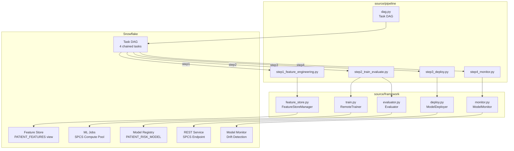

# Plan: Production ML Pipeline — `source/` Buildout

## Overview

This builds out the `source/framework/` and `source/pipeline/` directories to deliver a production-grade, fully orchestrated ML pipeline for the patient risk stratification use case. It is designed to be demo-ready for a 100+ person audience.

---

## Current State

| Path | Status |
|---|---|
| `source/framework/feature_store.py` | Complete — `FeatureStoreManager` |
| `source/framework/evaluator.py` | Complete — `Evaluator` |
| `source/framework/train.py` | **Empty** |
| `source/framework/deploy.py` | **Empty** |
| `source/pipeline/` | **Empty directory** |
| `source/train.py` | Complete local `PatientRiskTraining` — reused as the distributed entrypoint |

---

## Architecture



---

## File-by-File Details

### 1. `source/framework/train.py` — `RemoteTrainer`

```python
class RemoteTrainer:
    def __init__(self, session, database, schema, compute_pool, stage):
        ...

    def submit(self, num_instances: int = 1) -> MLJob:
        """Submit training via ML Jobs. num_instances > 1 = distributed."""
        job = submit_directory(
            dir_path="source",
            entrypoint="train.py",
            compute_pool=self.compute_pool,
            stage_name=self.stage,
            num_instances=num_instances,   # key: distributed flag
        )
        return job

    def wait_and_log(self, job: MLJob) -> str:
        """Block until done, stream logs, return final status."""
        job.wait()
        return job.status
```

When `num_instances > 1`, Snowflake ML Jobs provisions multiple SPCS nodes and launches a distributed PyTorch/sklearn job coordinator. The existing `source/train.py` is the entrypoint and already uses `n_jobs=-1` (all cores) which maps naturally to per-node parallelism. A flag in `train.py` will detect `RANK` env var to demonstrate true multi-node coordination.

---

### 2. `source/framework/deploy.py` — `ModelDeployer`

```python
class ModelDeployer:
    def deploy(self, model_name, version_name, service_name, compute_pool,
               min_instances=1, max_instances=3) -> str:
        mv = Registry(self.session, ...).get_model(model_name).version(version_name)
        mv.create_service(
            service_name=service_name,
            compute_pool=compute_pool,
            min_instances=min_instances,
            max_instances=max_instances,
        )
        # poll until RUNNING
        return service_name

    def predict(self, service_name, features_df) -> pd.DataFrame:
        """POST to REST endpoint, return predictions."""
```

---

### 3. `source/framework/monitor.py` — `ModelMonitor`

```python
class ModelMonitor:
    def create_monitor(self, monitor_name, model_name, version_name,
                       source_table, baseline_table, timestamp_col,
                       prediction_col, label_col) -> None:
        from snowflake.ml.monitoring import MonitorClient
        client = MonitorClient(session=self.session)
        client.add_monitor(
            name=monitor_name,
            source_config=SourceConfig(table=source_table, ...),
            model_monitor_config=ModelMonitorConfig(
                model_name=model_name,
                model_version_name=version_name,
                ...
            ),
        )
```

---

### 4. Pipeline Steps

Each step file follows the same pattern:
- `run(config: PipelineConfig, session: Session) -> dict` function
- `if __name__ == "__main__": main()` entry point (standalone runnable)
- Returns a result dict with status for task DAG error handling

#### `step1_feature_engineering.py`
1. Initialize `FeatureStoreManager`
2. Register `PATIENT` entity on `PATIENT_ID`
3. Build Snowpark feature DataFrame with 4 computed columns (SHOCK_INDEX, PULSE_PRESSURE, BMI_CATEGORY, VITAL_SIGNS_SEVERITY)
4. Register `PATIENT_FEATURES` feature view with `refresh_freq="1 minute"`
5. Retrieve feature values → write `TRAINING_FEATURES` and `TEST_FEATURES` tables

#### `step2_train_evaluate.py`
1. Instantiate `RemoteTrainer`
2. Submit job with `num_instances` from config (defaults to 3 for distributed demo)
3. Poll with `wait_and_log()`
4. Instantiate `Evaluator`, call `evaluate_from_registry()`
5. Call `check_promotion_criteria(thresholds={"accuracy": 0.80, "f1_macro": 0.75})`
6. Call `log_metrics()` to `MODEL_METRICS` table

#### `step3_deploy.py`
1. Get latest model version from Registry
2. Instantiate `ModelDeployer`
3. Call `deploy()` targeting `PATIENT_RISK_SERVICE` on compute pool
4. Call `predict()` with 3 sample rows to confirm endpoint responds

#### `step4_monitor.py`
1. Instantiate `ModelMonitor`
2. Call `create_monitor()` referencing deployed service and `TEST_FEATURES` as baseline
3. Print monitor config summary

---

### 5. `source/pipeline/dag.py` — Task DAG

```python
def create_pipeline_dag(session, config: PipelineConfig) -> None:
    db = config.snowflake.database
    schema = config.snowflake.schema_name
    wh = config.snowflake.warehouse

    # Create 4 stored procedures (one per step)
    session.sql(f"""
        CREATE OR REPLACE PROCEDURE {db}.{schema}.RUN_FEATURE_ENGINEERING()
        RETURNS VARIANT LANGUAGE PYTHON RUNTIME_VERSION='3.11'
        PACKAGES=('snowflake-ml-python','scikit-learn')
        HANDLER='handler'
        AS $$
        def handler(session):
            from source.pipeline.step1_feature_engineering import run
            from source.configs import get_config
            return run(get_config(), session)
        $$
    """).collect()
    # ... repeat for steps 2-4

    # Wire Task DAG
    session.sql(f"""CREATE OR REPLACE TASK {db}.{schema}.PIPELINE_ROOT_TASK
        WAREHOUSE={wh} SCHEDULE='USING CRON 0 2 * * 0 America/Los_Angeles'
        AS CALL {db}.{schema}.RUN_FEATURE_ENGINEERING()""").collect()

    session.sql(f"""CREATE OR REPLACE TASK {db}.{schema}.PIPELINE_TRAIN_TASK
        WAREHOUSE={wh} AFTER {db}.{schema}.PIPELINE_ROOT_TASK
        AS CALL {db}.{schema}.RUN_TRAIN_EVALUATE()""").collect()

    # ... DEPLOY and MONITOR tasks with AFTER chaining

    session.sql(f"ALTER TASK {db}.{schema}.PIPELINE_ROOT_TASK RESUME").collect()
```

---

### 6. `DEMO_GUIDE.md`

Structure:
1. **Setup Checklist** — prerequisites, env vars, one-time setup commands
2. **Architecture Overview** — talking points for each Snowflake service used
3. **Step-by-Step Demo Script** — what to run, what to say, what to show in Snowsight
4. **Key Demo Moments** — Feature Store UI, ML Jobs progress view, Registry version comparison, REST endpoint test, Monitor drift dashboard
5. **Distributed Training Talking Points** — how to explain `num_instances`, what the audience sees
6. **Troubleshooting Quick Reference** — common issues and fixes
7. **Q&A Preparation** — anticipated questions with concise answers

---

## What Does NOT Change

- `source/train.py` — already the distributed job entrypoint; minor additions only (RANK-aware logging)
- `source/configs.py` / `source/config.yaml` — no changes; pipeline steps all import from here
- `source/utils.py` — no changes
- `source/framework/feature_store.py` — no changes
- `source/framework/evaluator.py` — no changes
- All `setup/` and `notebooks/` files — untouched
